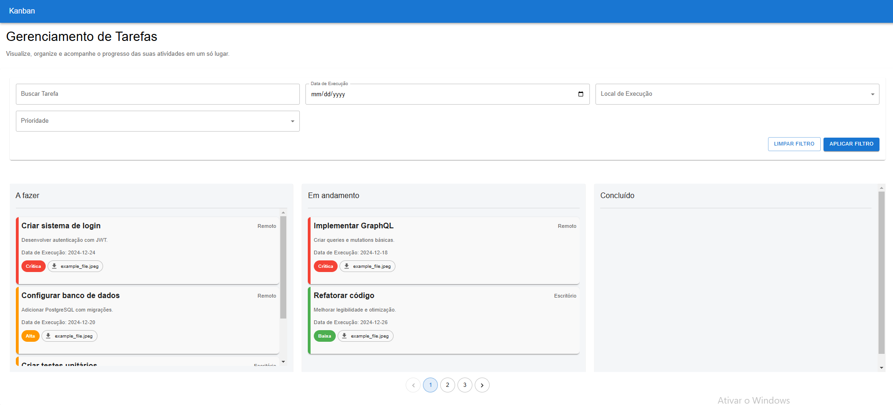
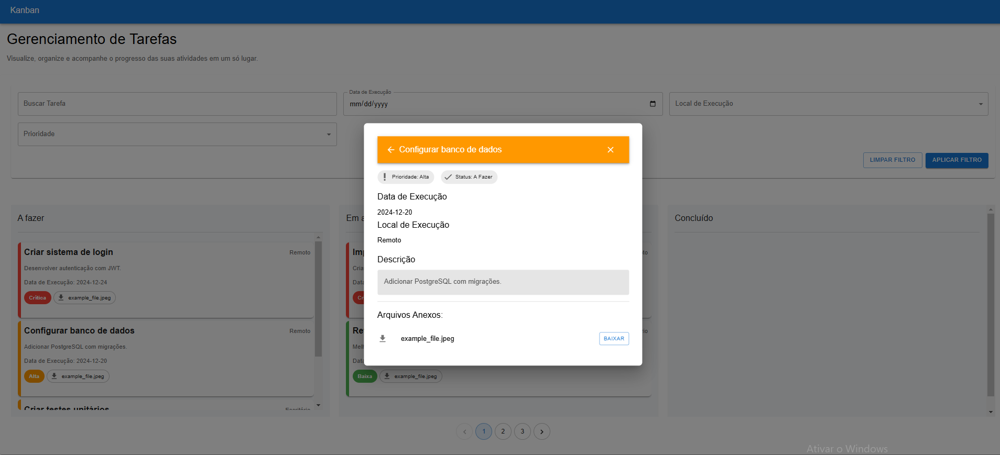

# Documentação do Projeto




Este projeto é uma aplicação de Kanban desenvolvida com React e Material UI, proporcionando uma interface simples e intuitiva para o gerenciamento de tarefas. Ele permite que os usuários organizem suas atividades em diferentes estágios do processo (como "A Fazer", "Em Progresso" e "Concluído").

## Estrutura de Pastas

Abaixo segue a organização das pastas do projeto React:

```
/src
  /components    # Componentes reutilizáveis da aplicação
  /hooks         # Hooks personalizados
  /utils         # Funções auxiliares
  /api           # Integrações com o backend (API GraphQL)
  /assets        # Arquivos estáticos (imagens, ícones, etc.)
  /styles        # Estilização global e temas
```

## Bibliotecas Utilizadas

As principais bibliotecas utilizadas no projeto foram:

- **React**: Biblioteca base para criação de interfaces.
- **Material UI**: Para estilização e componentes prontos, como botões, formulários e layouts.
- **Apollo Client**: Para consumo e cache de dados da API GraphQL.

## Decisões Técnicas Relevantes

1. **Material UI**: Escolhido para acelerar o desenvolvimento da interface e garantir um design responsivo e moderno.
2. **Apollo Client**: Utilizado para facilitar a integração com o backend em GraphQL, permitindo gerenciamento de estados e cache automático.
3. **Estrutura Modular**: A separação em componentes e páginas foi feita para garantir maior reutilização de código e facilidade de manutenção.
4. **Envíronment Variables**: Implementado o uso da variável `REACT_APP_BACKEND_URL` para configurar a URL do servidor backend, garantindo flexibilidade entre ambientes de desenvolvimento e produção.

## Inicialização do Projeto

Para inicializar o projeto localmente, siga os passos abaixo:

1. Clone o repositório:

   ```bash
   git clone https://github.com/joao-carlos-pereira-alves/kanban-react.git
   ```

2. Navegue até o diretório do projeto:

   ```bash
   cd kanban-react
   ```

3. Instale as dependências:

   ```bash
   npm install
   ```

4. Adicione o arquivo `.env` na raiz do projeto contendo a seguinte variável:

   ```env
   REACT_APP_BACKEND_URL=http://localhost:4000/api/graphql
   ```

   > Caso não seja configurada, o projeto irá assumir `http://localhost:4000/api/graphql` como padrão.

5. Inicie o servidor de desenvolvimento:

   ```bash
   npm start
   ```

6. Acesse o projeto no navegador através de:

   ```
   http://localhost:3000
   ```
